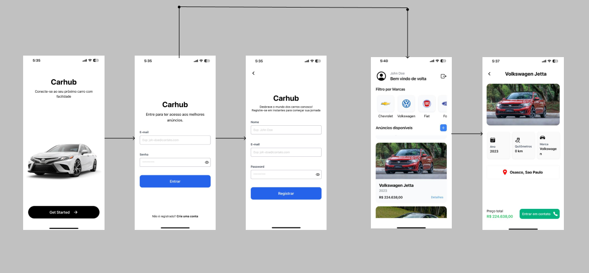

<h1 align="center">Carhub</h1>
<p align="center">
<strong> CarHub: Conectando Paixões Automotivas</strong>

Explore o emocionante universo automotivo com o CarHub, o seu destino definitivo para anúncios de carros! Projetado para entusiastas, compradores e vendedores de automóveis, o CarHub oferece uma experiência única que vai além dos anúncios convencionais.</p>

<h3 align="center">
   <a href="https://www.linkedin.com/in/alexsandrogomes/">
    
  </a>
  <a href="#" target="_blank">
    
  </a>
</h3>

<br />

## Preview

<p>Sample preview running the app:</p>

<p align="center">
  
</p>

## Building

You'll need [Expo](https://expo.io/) installed on your computer in order to build this app.

Access your preferred terminal, perform the steps below to start the application.

```bash
# Repository
git clone https://github.com/Alexsandrogms/carhub.git

# Directory
$ cd carhub/

# Install Dependencies
$ yarn install # or npm install

# Run the development API
$ yarn dev:server # or npm run dev:server

# Run application
$ yarn start # npm run start # expo start

```

## Author

😎 Alexsandro Gomes

- Github: [@alexsandrogms](https://github.com/Alexsandrogms)
- Linkedin: [@alexsandrogms](https://linkedin.com/in/alexsandrogomes)

## Contribuindo

Contributions, problems and requests for new features are welcome!
Did you like the project? Take a ⭐️!
